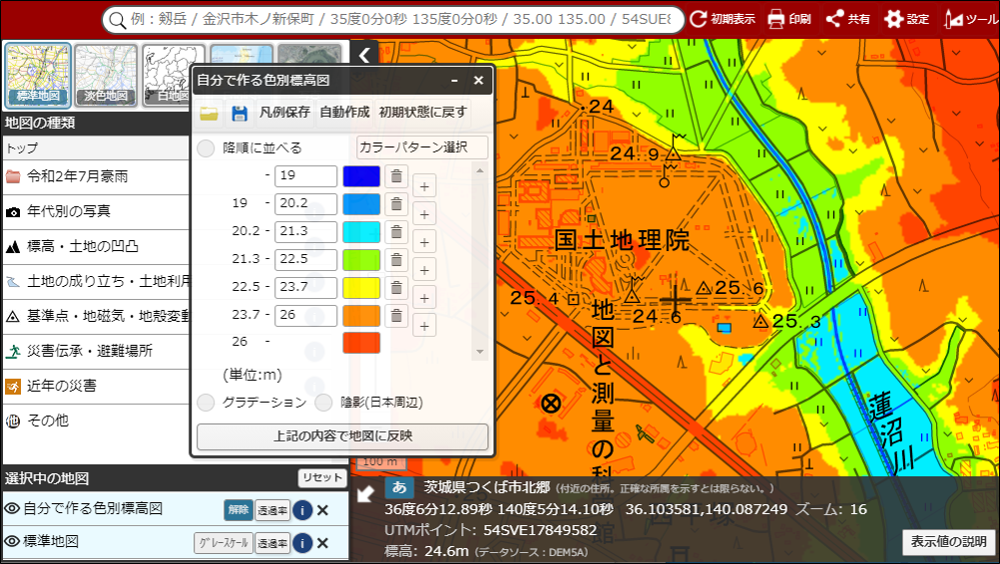

# 地理院地図の「自分で作る色別標高図」の標高値を0.1m刻みで設定できるサンプルサイト

**K**omakai **R**elief **M**ap **S**am**P**le

## 本レポジトリについて

地理院地図には、標高に応じて色分けした地図を作る機能「自分で作る色別標高図」がありますが、標高値の設定は0.5m刻みを最小の限度としております。

本レポジトリは、最小の限度を0.1m刻みにしたものです。

[地理院地図の「自分で作る色別標高図」の標高値を0.1m刻みで設定できるサンプルサイト](https://gsi-cyberjapan.github.io/krmsp/index.html)

## 使い方

通常の「自分で作る色別標高図」の使い方と同じです。

「自分で作る色別標高図」の使い方は以下の動画をご覧ください。

## 注意事項

標高データは複数の測量方法により整備されていますが、最も精度の良い航空レーザ測量でも標高値の精度は標準偏差で0.3mです。この点をご理解の上、本レポジトリをご利用ください。

本レポジトリは実験的に提供しているものです。動作保証は行っておりません。

また、予告なく変更・削除する可能性があります。

本レポジトリの利用により生じた損失及び損害等について、国土地理院はいかなる責任も負わないものとします。

